Site URL: https://nik-mak.netlify.app/

Github: https://github.com/nik-mak/Portfolio

Purpose:
This portfolio was made for assessment at Coder Academy using HTML and CSS. May also use it in the future to showcase my skills and act as an online resume.

Functionality/Features:
- The navbar always remains at the top with links to the other pages.
- Footer is on the bottom of the page with icons that link to my socials.
- Link to download resume at the bottom of the education and experience section of the about me page.
- Links to the various projects in the projects page.
- Contact page with icons and user-names to socials that link and open new tab.
- Email on contact page that when clicked opens the users email and as the TO and subject area filled.
- Hover feature on all links and buttons.
- Responsive layout so that all elements are appropriately displayed no matter the device.

Wireframes:
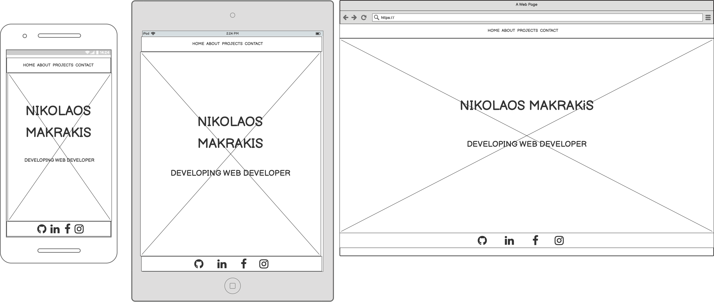

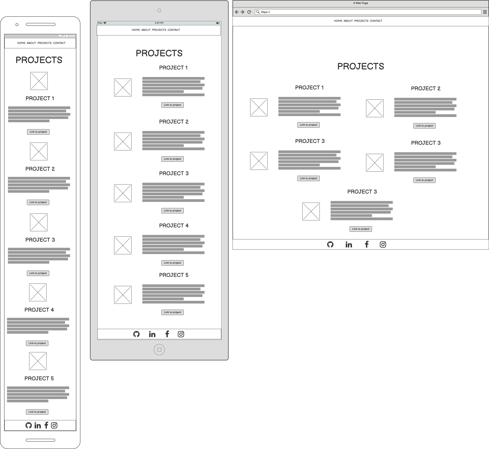
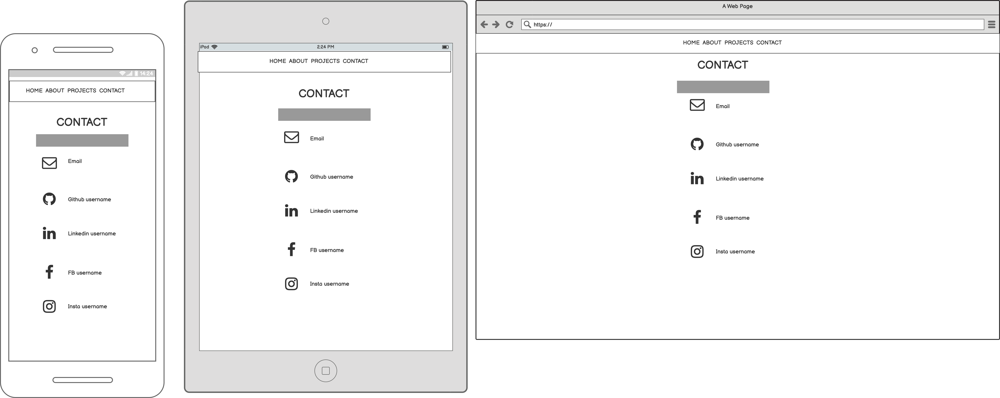

Screenshots:

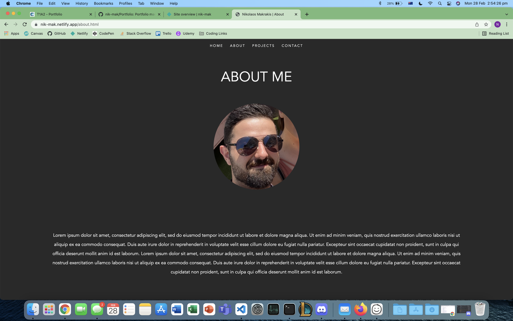
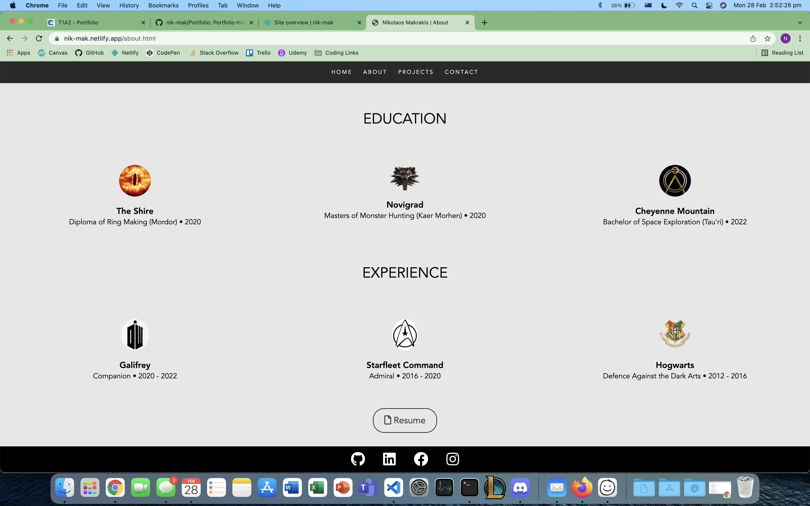
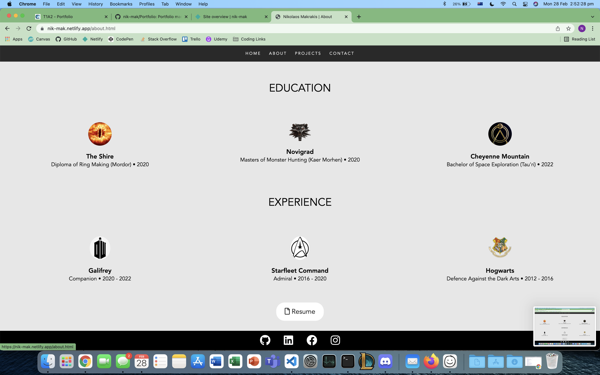
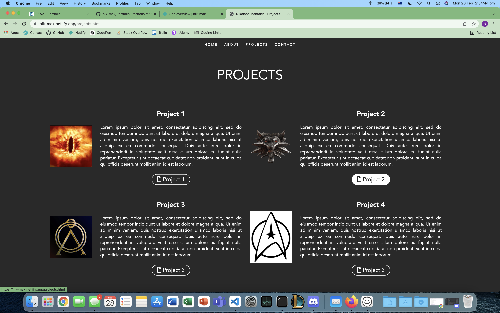
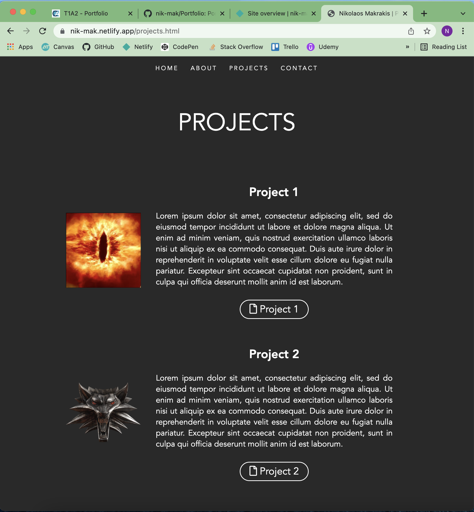
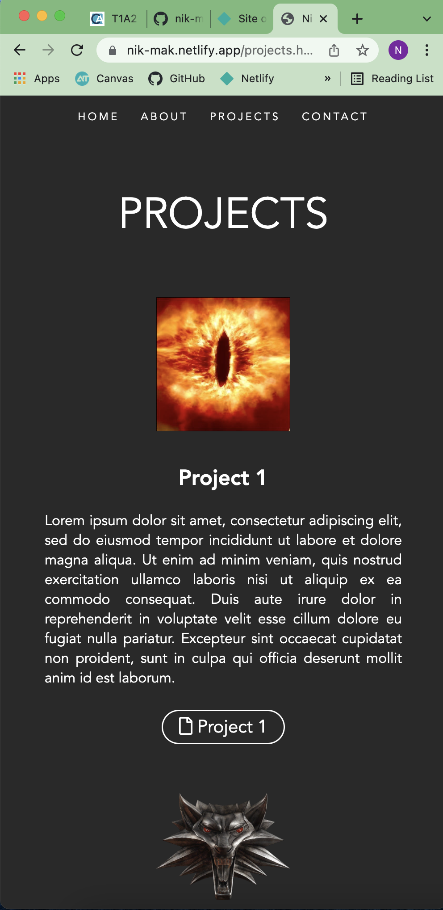
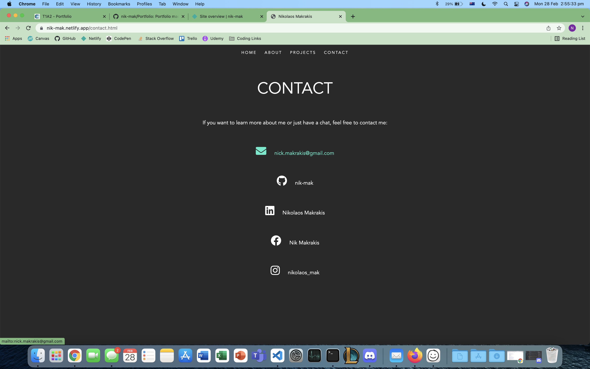
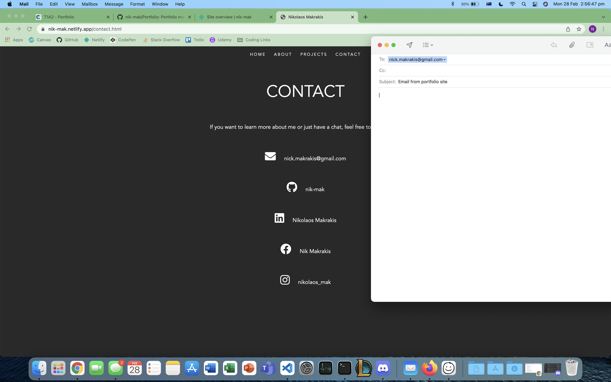

Target Audience:
An employer looking to engage a dev and/or IT professional. 

Tech Stack:
- HTML
- CSS
- Github
- Netlify